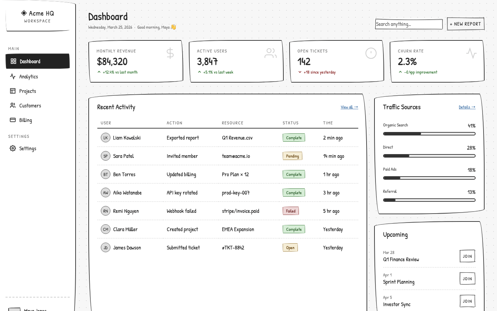
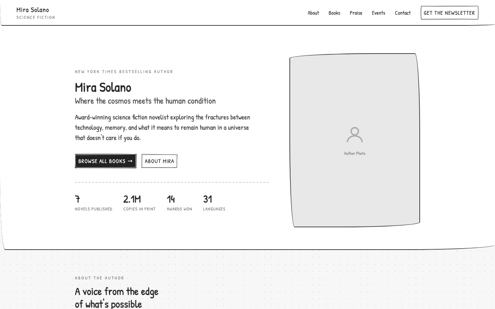

# Wireframer — AI Agent Skill

An AI agent skill that turns a plain text prompt into a functional, low-fidelity, hand-drawn web prototype. Think Balsamiq — but generated instantly from a description, right inside your project.

Prototypes are clickable SPAs with a sketchbook aesthetic: dotted backgrounds, wobbly hand-drawn borders, sketchy UI components, and doodle icons. No graphic design required — the focus is on layout, content, and flow.

Works with any AI coding assistant: Claude Code, Cursor, Windsurf, GitHub Copilot, Gemini, and others.

---

## Installation

### Claude Code
```
/plugin marketplace add agilek/wireframer-skill
/plugin install wireframes-designer@wireframer-skill
```

Then invoke it in any project:
```
/wireframer Build a SaaS dashboard with a sidebar, KPI overview row, and recent activity table.
```

### Cursor / Windsurf / Copilot / other agents
Copy the contents of [`skills/wireframer/SKILL.md`](skills/wireframer/SKILL.md) into your AI instruction file:

| Tool | File |
|---|---|
| Cursor | `.cursorrules` |
| Windsurf | `.windsurfrules` |
| Gemini | `gemini.md` |
| GitHub Copilot | `.github/copilot-instructions.md` |
| Any agent | `agents.md` |

Then prompt your agent:
```
Generate a wireframe prototype for: a SaaS dashboard with a sidebar, KPI overview row, and recent activity table.
```

---

## Live previews

| SaaS Dashboard | Bio / Profile Page |
|---|---|
| [](https://agilek.github.io/wireframer-skill/samples/dashboard.html) | [](https://agilek.github.io/wireframer-skill/samples/bio.html) |

---

## What gets generated

- **Wired Elements** — all interactive UI (buttons, inputs, cards, checkboxes, tabs, toggles, etc.) uses [`wired-elements`](https://github.com/rough-stuff/wired-elements) web components for a hand-drawn SVG look
- **Doodle Icons** — icons use [`react-doodle-icons`](https://github.com/agilek/react-doodle-icons), a library of 439 hand-drawn icons across 17 categories
- **Sketchy aesthetics** — dotted graph-paper background, irregular borders, Patrick Hand / Caveat / Comic Neue fonts from Google Fonts
- **Realistic copy** — context-aware body text generated from your description; no lorem ipsum

---

## Supported environments

| Environment | Wired Elements | Icons |
|---|---|---|
| React (≥ 18) | npm package | `react-doodle-icons` named imports |
| Vue / Svelte / other | npm package | inline SVG |
| Vanilla HTML | CDN (`unpkg`) | inline SVG |

For React projects, navigation is handled with `useState` — no routing library needed.

---

## Example prompts

```
Generate a wireframe for a three-screen mobile onboarding flow for a fitness tracking app.
```

```
Generate a wireframe for a checkout flow: cart summary, shipping details, and order confirmation screens.
```

```
Generate a wireframe for a project management tool with a kanban board, task detail panel, and team sidebar.
```

---

## Aesthetic rules enforced

- Strict grayscale — black, white, and grays only
- Primary actions in muted sketchy blue; secondary as ghost; all links underlined
- Sketchy border trick: `border-radius: 255px 15px 225px 15px / 15px 225px 15px 255px`
- Graph-paper background: `radial-gradient(#d7d7d7 1px, transparent 1px)`
- On first run, context rules are written to the project's AI instruction file (`agents.md`, `.cursorrules`, etc.) so the aesthetic persists across sessions

---

## License

MIT
