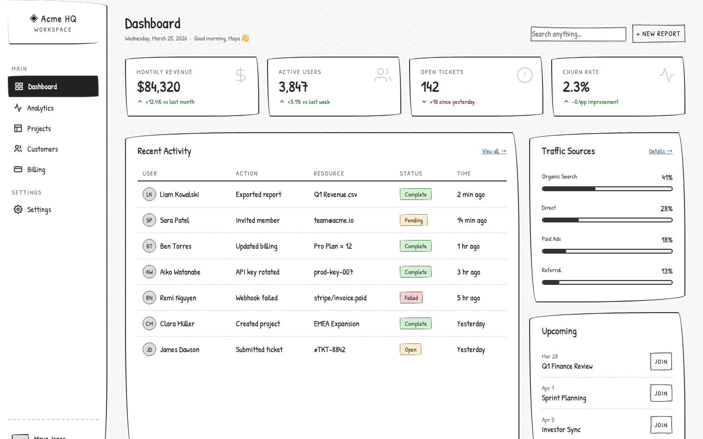
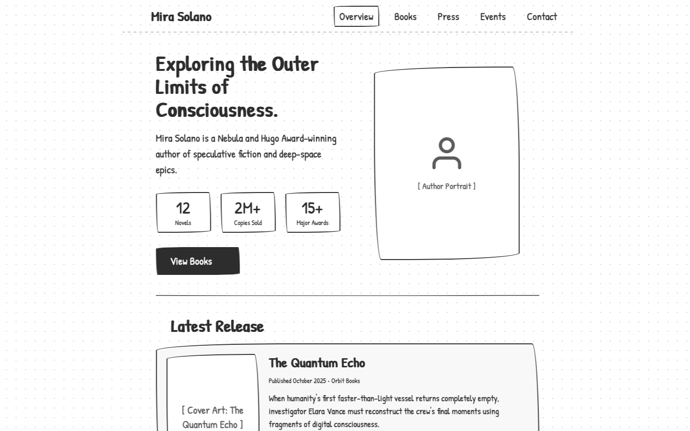

# Wireframer — AI Agent Skill

An AI agent skill that turns a plain text prompt into a functional, low-fidelity, hand-drawn web prototype. Think Balsamiq — but generated instantly from a description, right inside your project.

Prototypes are clickable SPAs with a sketchbook aesthetic: dotted backgrounds, wobbly hand-drawn borders, sketchy UI components, and doodle icons. No graphic design required — the focus is on layout, content, and flow.

Works with any AI coding assistant: Claude Code, Cursor, Windsurf, GitHub Copilot, Gemini, and others.

---

## Installation

### Any agent — recommended
```bash
npx skills add agilek/wireframer-skill
```
Automatically installs into the right directory for your agent (Claude Code, Cursor, Windsurf, Copilot, Gemini, and [40+ others](https://github.com/vercel-labs/skills)).

### Update
```bash
npx skills update
```

### Manual install
Copy the contents of [`SKILL.md`](SKILL.md) into your AI instruction file:

| Tool | File |
|---|---|
| Cursor | `.cursorrules` |
| Windsurf | `.windsurfrules` |
| Gemini | `gemini.md` |
| GitHub Copilot | `.github/copilot-instructions.md` |
| Any agent | `agents.md` |

---

## Live previews

| SaaS Dashboard | Bio / Profile Page |
|---|---|
| [](https://agilek.github.io/wireframer-skill/samples/dashboard.html) | [](https://agilek.github.io/wireframer-skill/samples/bio.html) |

---

## What gets generated

- **Wired Elements** — all interactive UI (inputs, cards, checkboxes, tabs, toggles, etc.) uses [`wired-elements`](https://github.com/rough-stuff/wired-elements) web components for a hand-drawn SVG look
- **Doodle Icons** — icons use [`react-doodle-icons`](https://github.com/agilek/react-doodle-icons), a library of 439 hand-drawn icons across 17 categories
- **Sketchy aesthetics** — dotted graph-paper background, irregular borders, Patrick Hand / Caveat / Comic Neue fonts from Google Fonts
- **Realistic copy** — context-aware body text generated from your description; no lorem ipsum

---

## Supported environments

| Environment | Wired Elements | Icons |
|---|---|---|
| React (≥ 18) | npm package | `react-doodle-icons` named imports |
| Vue / Svelte / other | npm package | inline SVG |
| Vanilla HTML | CDN (`unpkg`) | inline SVG |

For React projects, navigation is handled with `useState` — no routing library needed.

---

## When to use this skill

Invoke the wireframer when you want to:

- **Validate a concept** before writing any production code
- **Communicate layout and flow** to stakeholders or teammates without visual polish
- **Run a design sprint** — generate multiple screen variants quickly and compare
- **Prototype a user journey** — multi-screen flows with working navigation
- **Sketch an MVP** — turn a product idea into something clickable in minutes

Trigger phrases: *wireframe*, *mockup*, *lo-fi prototype*, *rough layout*, *sketch the screens*, *Balsamiq-style*, *hand-drawn UI*, *clickable prototype*, *visualize the flow*, *show what the app would look like*.

---

## Example prompts

### SaaS & dashboards
```
Wireframe a SaaS analytics dashboard with a collapsible sidebar, KPI cards row, a line chart, and a recent activity table.
```
```
Wireframe an admin panel for a multi-tenant SaaS: user management table, role assignment modal, and billing overview.
```

### E-commerce
```
Wireframe a product detail page with image gallery, size selector, reviews section, and sticky add-to-cart bar.
```
```
Wireframe a checkout flow: cart summary, shipping form, payment step, and order confirmation screen.
```

### Mobile flows
```
Wireframe a three-screen mobile onboarding for a fitness tracking app: welcome, goal setup, and notification permissions.
```
```
Wireframe a mobile food delivery app: restaurant listing, menu screen, and cart with order summary.
```

### Marketing & landing pages
```
Wireframe a SaaS landing page: hero with CTA, features grid, pricing table with three tiers, and footer.
```
```
Wireframe a personal portfolio: hero, about section, project cards grid, skills list, and contact form.
```

### Productivity & tools
```
Wireframe a project management tool with a kanban board, task detail slide-over panel, and team members sidebar.
```
```
Wireframe an email client: folder list sidebar, message list, and reading pane with reply box.
```

### Social & community
```
Wireframe a social feed with stories row, post cards, comment thread, and a floating compose button.
```
```
Wireframe a community forum: category list, thread listing, and a post detail page with nested replies.
```

### Forms & onboarding
```
Wireframe a multi-step signup wizard for a B2B tool: account details, team invite, workspace setup, and done screen.
```
```
Wireframe a settings page with tabs for Profile, Notifications, Security, and Billing.
```

### Cloning an existing page
```
Convert the page at https://example.com into a hand-drawn wireframe. Preserve the layout, sections, and content hierarchy but render everything in the sketchy wireframe aesthetic.
```
```
I've pasted the HTML of our current homepage below. Re-create it as a low-fidelity wireframe prototype, keeping the same structure and copy but applying the hand-drawn aesthetic.
```

---

## Aesthetic rules enforced

- Strict grayscale — black, white, and grays only
- Primary buttons: dark fill (`#333`) with white text; secondary: white fill with dark sketchy border
- All containers have a solid white background so the graph-paper pattern never bleeds through content
- No emoji — icons use `react-doodle-icons` or inline SVG only
- Sketchy border trick: `border-radius: 255px 15px 225px 15px / 15px 225px 15px 255px`
- Graph-paper background: `radial-gradient(#d7d7d7 1px, transparent 1px)`
- On first run, context rules are written to the project's AI instruction file (`agents.md`, `.cursorrules`, etc.) so the aesthetic persists across sessions

---

## License

MIT
